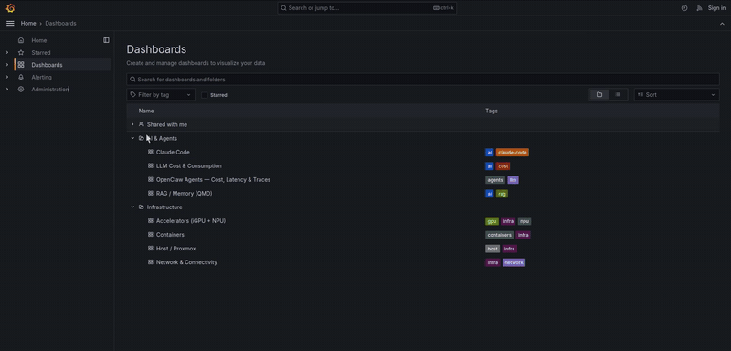
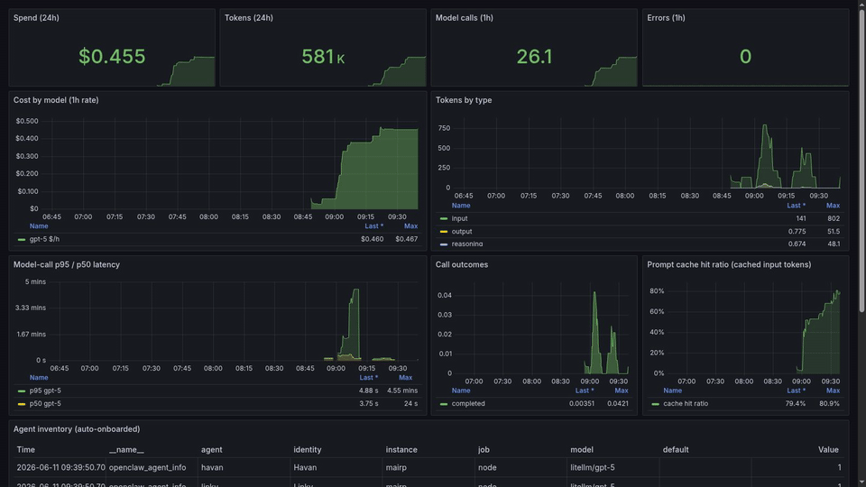

# agent-observability-stack

A self-hostable observability stack for **LLM agents + a Linux host (Intel iGPU/NPU aware)**, built
as a single LAN-accessible pane of glass. Two pipelines, one Grafana:

- **Infra metrics (pull):** CPU, RAM, disk, network + latency, containers, and **Intel iGPU/NPU**
  telemetry → Prometheus.
- **Agent telemetry (push):** [OpenClaw](https://openclaw.ai) diagnostics → OTLP → OpenTelemetry
  Collector → **Grafana Tempo** (traces) + Prometheus (metrics); LLM **tokens, cost, latency, cache**
  from a [LiteLLM](https://litellm.ai) proxy.

New agents, containers, and accelerators **onboard themselves** — no per-target config edits.

## Demo

Full walkthrough (~70s) — the dashboards end to end:

https://github.com/user-attachments/assets/eadd8692-f04e-411f-b637-1ed303786784

Per-pipeline highlights:

**Infra pipeline** — host, accelerators, containers:



**Agents pipeline** — cost, tokens, latency, call outcomes, traces, live agent inventory, plus the
**Claude Code & RAG** dashboard (Claude Code token usage / cache / cost, and QMD index health):



## Architecture

```
INFRA METRICS (pull)                    AGENT / AI TELEMETRY (push)
 node_exporter ─┐                        OpenClaw gateway          Claude Code (OTel)
 cadvisor      ─┤                         ├─ diag-prometheus ─(loopback textfile)─┐   │
 blackbox      ─┼─► Prometheus ◄──────────┤                                       │   │ OTLP
 intel npu/gpu ─┤        ▲                 └─ diag-otel ──OTLP─┐                   │   ▼
 litellm /metrics┘       │                                    ▼                   └► OTel Collector
                         │                              OTel Collector ──traces──► Tempo
                         │                                   │  │  └────logs───────► Loki
                         └───────────────(metrics)───────────┘  │                     │
                      Grafana ◄────────── Prometheus + Tempo + Loki datasources ◄──────┘
                   (LAN :3000)   folders: Infrastructure · AI & Agents
                         ▲
        grafy-bot (Telegram /graph) · grafana-image-renderer (PNG) · Alertmanager → Telegram
```

## Quickstart

```bash
cp .env.example .env          # fill in Grafana password, OpenClaw scrape token, Telegram bot, etc.
make up                       # render secrets + docker compose up -d
# host-side accelerator + diagnostics collectors (systemd):
sudo cp systemd/*.service systemd/*.timer /etc/systemd/system/
sudo systemctl enable --now accel-textfile.timer observability-onboard.timer
```

Open Grafana at `http://<HOST_LAN_IP>:3000`. Dashboards are provisioned into two folders:
**Infrastructure** (host, accelerators, network, containers) and **AI & Agents** (Claude Code,
LLM Cost & Consumption, OpenClaw Agents, RAG).

| Service                  | Port | Purpose                                        |
|--------------------------|------|------------------------------------------------|
| Grafana                  | 3000 | dashboards (LAN)                               |
| Prometheus               | 9090 | metrics TSDB                                    |
| Tempo                    | 3200 | trace store                                    |
| Loki                     | 3100 | logs/events store (Claude Code per-request events) |
| OTel Collector           | 4317/4318 | OTLP ingest — traces→Tempo, metrics→Prom, logs→Loki |
| Alertmanager             | 9093 | alert routing → Telegram                       |
| grafana-image-renderer   | 8081 | server-side PNG rendering (for the bot)         |
| grafy-bot                | —    | Telegram `/graph` bot (image + values)          |

## Claude Code metrics

[Claude Code](https://claude.com/claude-code) ships native **OpenTelemetry**. Enable it in your
**shell environment** — add this to `~/.bashrc` (or `~/.zshrc`) and **restart the session**:

```bash
export CLAUDE_CODE_ENABLE_TELEMETRY=1
export OTEL_METRICS_EXPORTER=otlp
export OTEL_LOGS_EXPORTER=otlp
export OTEL_EXPORTER_OTLP_PROTOCOL=http/protobuf
export OTEL_EXPORTER_OTLP_ENDPOINT=http://localhost:4318
export OTEL_METRIC_EXPORT_INTERVAL=10000
export OTEL_LOGS_EXPORT_INTERVAL=5000
export OTEL_RESOURCE_ATTRIBUTES=service.name=claude-code
```

> **Gotcha:** putting these in `~/.claude/settings.json`'s `env` block does **not** work — that block
> isn't applied to Claude Code's telemetry exporter, so metrics stay at 0. It must be in the shell env.

The **Claude Code** dashboard then breaks consumption out **by model** (Opus/Sonnet/Haiku), **by token
type** (input / output / cacheRead / cacheCreation), and **by named subagent** (Explore/Plan/… from
`subagent_completed` events), plus cost, cache-read per model, request count and **p95 latency**. It is
built on the per-request **`api_request` events in Loki** (`{service_name="claude-code"}`) rather than
the OTLP counters — the events persist (the counters are ephemeral and short sessions exit before the
metric flush). No prompt/response content is exported — counts and event metadata only.
See [docs/agents.md](docs/agents.md) and [docs/dashboards.md](docs/dashboards.md).

## What you get

- **Host & virtualization-host dashboards** (node_exporter), **Intel Arc iGPU** (busy %, freq, power) and
  **Intel NPU** (busy, freq, memory) panels, network reachability + latency (blackbox), per-container
  resources (cAdvisor).
- **Agents**: per-model call latency (p50/p95), call volume & outcomes (OpenClaw), tokens + spend +
  prompt-cache hit ratio (LiteLLM), and **per-run traces** in Tempo. A live **agent inventory** table
  updates as agents are added.
- **Claude Code (by model + subagent)**: persistent consumption from per-request **Loki events** —
  cost & tokens **per model** (Opus/Sonnet/Haiku), tokens by type (input / output / cache-read /
  cache-creation), cache-read per model, request count & **p95 latency**, and **named subagents**
  (runs/tokens by `agent_type` — Explore/Plan/… — and by model), with a drill-down logs panel.
- **LLM Cost & Consumption**: unified spend/tokens across Claude Code + OpenClaw/LiteLLM, by model/provider.
- **Memory breakdown**: system RAM %, and how much is the **iGPU** / **NPU** (they share system RAM) —
  a "where's my RAM" view in bytes and % of total.
- **RAG**: QMD index health (docs, vectors, freshness) per index.
- **Logs (Loki)**: the OTel Collector's logs pipeline ships Claude Code events to Loki; queryable in
  Grafana. Dashboards are grouped into **Infrastructure** and **AI & Agents** folders.
- **Alerting**: label-matched rules (host pressure, target-down, NPU/iGPU saturation, model latency,
  daily spend budget) → Alertmanager → Telegram.
- **Telegram bot (Grafy)**: text `/graph <dashboard> [range]` to get a rendered dashboard **image +
  key values** on your phone, plus `/values`, `/alerts`, `/list` — chat-locked to you. See
  [docs/telegram-bot.md](docs/telegram-bot.md).
- **Self-onboarding**: a systemd timer + an optional OpenClaw `observ` cron-agent keep everything in
  sync as the fleet grows.

## Docs

- [Architecture](docs/architecture.md) · [Dashboards](docs/dashboards.md) · [Agents](docs/agents.md) · [Onboarding](docs/onboarding.md)
- [Hardware (iGPU/NPU + memory)](docs/hardware.md) · [Telegram bot](docs/telegram-bot.md) · [Alerting](docs/alerting.md) · [Security](docs/security.md)

## Tests

```bash
make validate   # static: compose, promtool (+ rule unit tests), amtool, otel, dashboards, shellcheck
make smoke      # live: targets up, metrics present, datasources healthy, Tempo trace ingest
make scan       # secret + host-leak scan
```

CI runs `validate` + a secret scan on every PR (`.github/workflows/ci.yml`).

## License

MIT
